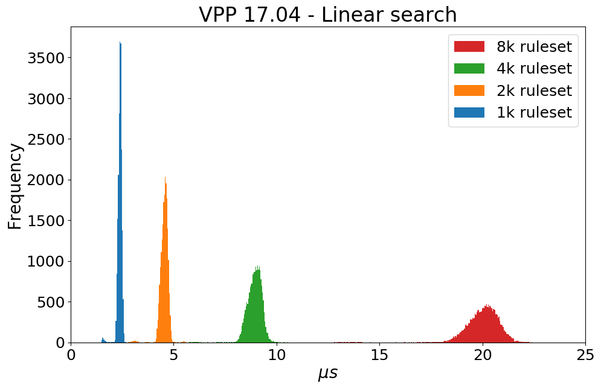

After the experiment has generated a dataset, we can parse and plot results with tools in this directory.

First, we have to merge all the data that has generated from the same ruleset seed (for each ruleset seed there are five different Ruleset). Then we plot the parsed output.

---
## RAW_DATA

a raw data example is in the directort ` $repository/RAW-DATA `

The filename is formatted in this way:

`acl1_1k_1_clk_22-11_12-04/Elog_acl1_seed_1.out`

`$seed_$size_clk_$experimentTimestamp/Elog_$seed_seed_$#experiment.out`

In each file is contained the Elog events (`struct{$vector_size \t $clock_cycles}`) for the experiment with that particular ruleset

---
* `script_merge_exp.sh <raw data directory>`

e.g. `script_merge_exp $repository/RAW-DATA `

This script will create a directory (elog_parsed_clk), in the path put in input, in which it will be saved the new files.

E.g. all files in the directory `acl1_1k_1_clk_22-11_12-04/` will be mapped in just one file `Elog_acl1_1k_tot.out`, in which each column corresponds to an experiment(same ruleset seed, same ruleset size, different ruleset), in which each element corresponds to the classification time average in clock cycles (clock_cycle/vector_size)

At the end, it will copy the file also in `$EXP_RES/Summary/Classification_$date/`, that it will be used for put these information in the summary table (see summary directory)

---
## Plotting
After parsing raw data, we can start plot information reported in.
in the Makefile are saved the commands to run in order to make comparison:
it is important to notice that the information related the plot (i.e. about path of files, information to plot, style of the plot) are saved in a different file (in order to generalize the python code) that are stored in the file_info directory (where is possible to find examples of configurations)


`hist`: to plot the histogram of classification time distributions per ruleset size.

e.g. as an example, we plot the throughput metric 



* `make hist_$target `


1. to select which metric to plot: `file_info/example.script`
```
off #don't show plot
paper #matplotlib style to create plot usable for papers
{'type':'thr', #extract throughput metric
'title':'Throughput', #set title
'namefile':'pps1',  #set namefile
'x-log':'on', #log-scale on x-axis
'y-log':'off', #log-scale on y-axis
'y-label':'Throughput (Mpps)'} #y-axis label
{'type':'class', #second figure to generate, it extracts classification time
'title':'Classification',
'namefile':'pps2',
'x-log':'on',
'y-log':'off',
'y-label':''}
```

2. to select file to plot: `file_info/example.file`. each line in the file represent a curve to plot. (comma is important for the parser!)
```
path_to_file,type_of_file,label,color,linestyle,linemarker,marker_full_none
```

3. to generate plot: `python hist_general.py file_info/example.script file_info/example.file`


The plot in the example has been made with the foolowing 4 kind of files (generated with the parser) 

```
$(path)/elog_parsed_clk/Elog_acl1_1k_tot.out
$(path)/elog_parsed_clk/Elog_acl1_2k_tot.out
$(path)/elog_parsed_clk/Elog_acl1_4k_tot.out
$(path)/elog_parsed_clk/Elog_acl1_8k_tot.out
```


