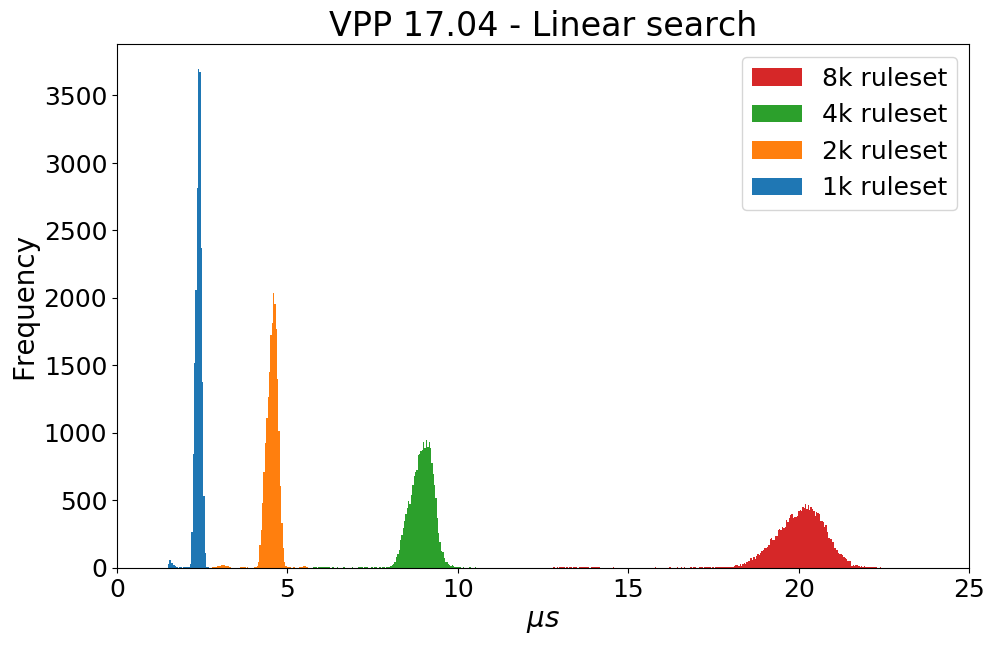

In this directory are contained all the tools to use to parse raw_data and generate plots.
Let's describe what you can do in each directory:

* **Classification_time**: here you can parse all data generated from the `classification-time.sh` script in Experiment directory (this kind of experiment requires that `VALE_ELOG` is defined in the vpp source file!!), and also plot a distribution on the classification time spent for a single packet
e.g. as an example 

* **Summary**: In this folder, there are a set of scripts that enable you to generate figures on the different metrics, starting from a general summary of previous experiments.
e.g. as an example 

* **Throughput**: here you can parse all data generated from the `acl-throughput_simple.sh` script in Experiment directory (ELOG variable MUST be undefined!)
