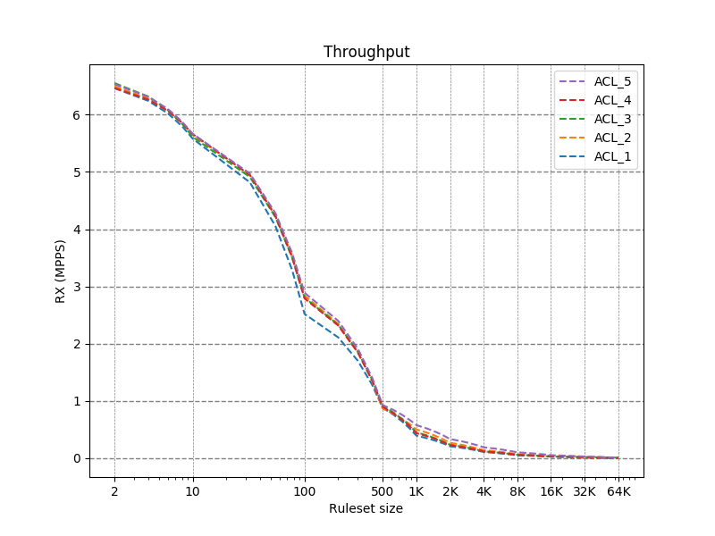
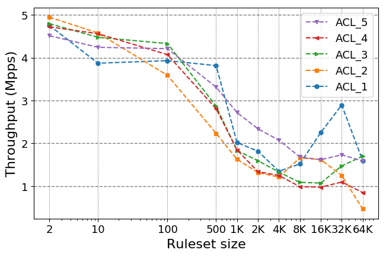

In this folder, there are a set of scripts that enable you to generate figures on the different metrics, starting from a general summary of previous experiments.

e.g. as an example, we plot the throughput metric 




---
# Generate Table
Firstly, we should generate a summary of previous experiments, running `script_table.sh`, below an example of the output file:
```
Size:           1	10	100	500	1K	2K	4K	8K	16K	32K	64k	
Throughput:     4.756	3.872	3.932	3.816	2.018	1.816	1.348	1.518	2.254	2.896	1.598	
Microseconds:	0.089	0.133	0.124	0.14	0.36	0.415	0.596	0.512	0.328	0.215	0.338	
Clock_cycle:	230.939	345.451	321.581	364.871	936.045	1078.133	1549.593	1332.036	851.82	559.485	878.272	
Partition:	1	2	3	5	9	9	17	14	8	9	17	
```

This script creates a directory in `$EXP_RES/Summary/Table_$date/`, where it stores tables that summarizing information found in `$EXP_RES/Summary/`, the following files are generated automatically from script runned in the other directory when we parse raw data from experiments.
1. about throughput `$seed\_fullspeed.out`
2. about classification time `$seed\_classification.out `
3. about partitions `$seed\_partition.out`

thus, this information are necessary in order to create the table file

---
# Generate plots
After generating these tables, we can start plot information reported in.
in the Makefile are saved the commands to run in order to make comparison: 
it is important to notice that the information related the plot (i.e. about path of tables, information to plot, style of the plot) are saved in a different file (in order to generalize the python code) that are stored in the file_info directory (where is possible to find examples of configurations)

1. to select which metric to plot: `file_info/example.script`
```
off #don't show plot
paper #matplotlib style to create plot usable for papers
{'type':'thr', #extract throughput metric 
'title':'Throughput', #set title
'namefile':'pps1',  #set namefile 
'x-log':'on', #log-scale on x-axis
'y-log':'off', #log-scale on y-axis
'y-label':'Throughput (Mpps)'} #y-axis label
{'type':'class', #second figure to generate, it extracts classification time
'title':'Classification', 
'namefile':'pps2', 
'x-log':'on', 
'y-log':'off', 
'y-label':''}
```

2. to select file to plot: `file_info/example.file`. each line in the file represent a curve to plot. (comma is important for the parser!)
```
path_to_table_total,type_of_file,label,color,linestyle,linemarker,marker_full_none
```

3. to generate plot: `python general-11.py file_info/example.script file_info/example.file`
